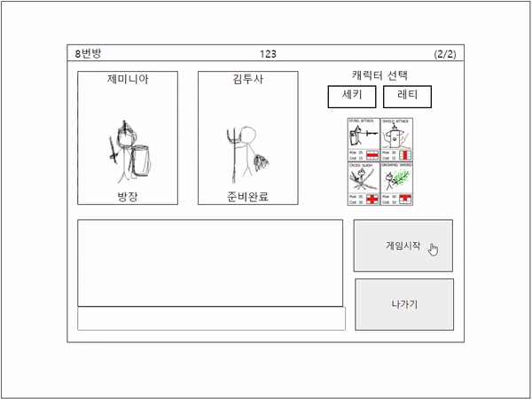

# 매직콜로세움 (MagicColosseum)

- 전략카드게임

## 기능

- 회원가입 & 로그인

- 방 만들기

- 방 입장 (+채팅)

- 실시간 전투

## 설치 방법 (Installation)

- server 사용언어 - Typescript, Mysql, TypeORM

- client 사용언어 - Typescript, React
- [/server] DB - Mysql 설치가 필요합니다.

## 사용법 (Usage)

- [/server] npm run dev

  > dev 서버 실행

- [/client] npm start
  > 클라이언트 실행
